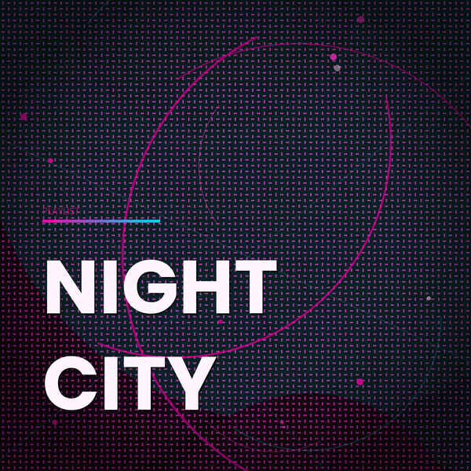
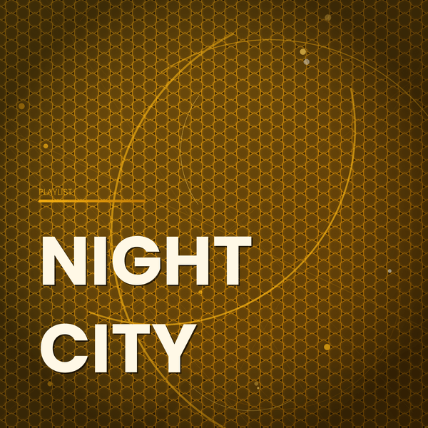
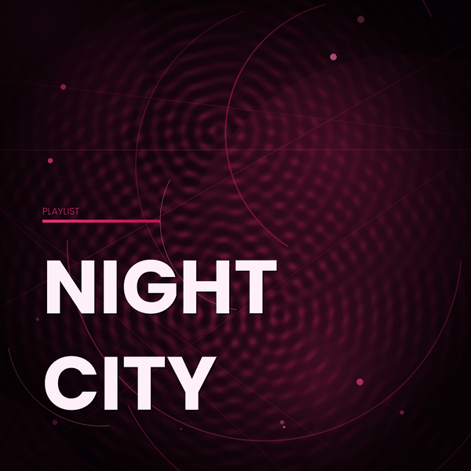

# CoverForge

> Generate bold, unique, production-ready Spotify playlist cover art from the command line.

CoverForge is a Python CLI tool that produces **3000×3000px** playlist cover images with zero design skills required. Every cover is deterministic — the same playlist name always generates the same artwork — but with 14 colour themes, 9 pattern engines, a matte black mode, and 9 text positions, you have complete creative control.

---

## Preview

| Cyberpunk + Carbon (Matte) | Obsidian Gold + Hexgrid (Matte) | Glacier Neon + Circuit |
|:-:|:-:|:-:|
|  |  |  |

| Violet Dusk + Shatter | Deep Abyss + Starfield | Midnight Rose + Waves |
|:-:|:-:|:-:|
|  |  |  |

---

## Features

- **14 colour themes** — Cyberpunk, Matte Black, Obsidian Gold, Glacier Neon, Void Crimson, Violet Dusk, and more
- **9 pattern engines** — Carbon fibre, Hex grid, Plasma field, Circuit board, Voronoi shatter, Starfield bokeh, Concentric waves, Scanlines, Geometric mesh
- **Matte black mode** (`--matte`) — kills all background glows, cranks pattern contrast for carbon and hexgrid
- **9 text positions** — bottom-left, center, top-right, and everything in between
- **Smart filenames** — theme + pattern + position + matte all reflected in the output filename, never overwrites
- **Batch mode** — generate all 14 themes in one command with `--theme all`
- **Custom fonts** — point at any `.ttf`/`.otf` file or directory, bold and light weights auto-detected
- **Auto directory creation** — `--output` creates nested paths if they don't exist
- **3000×3000px output** — Spotify's full native resolution, ready to upload

---

## Requirements

- Python 3.10+
- [Pillow](https://python-pillow.org/) >= 9.0
- [NumPy](https://numpy.org/) >= 1.22

```bash
pip install pillow numpy
```

---

## Installation

```bash
git clone https://github.com/yourusername/coverforge.git
cd coverforge
pip install pillow numpy
```

No further setup required. The script auto-detects fonts installed on your system.

---

## Fonts

CoverForge looks for fonts in this order:

1. `~/.fonts/truetype/google-fonts/` — **recommended location**
2. System-wide `/usr/share/fonts/` — most Linux distros
3. Any path you pass via `--font`

**Recommended: [Poppins](https://fonts.google.com/specimen/Poppins)** (free, by Google Fonts)

```
# Download from fonts.google.com/specimen/Poppins
# Extract and place at:
~/.fonts/truetype/google-fonts/Poppins-Bold.ttf
~/.fonts/truetype/google-fonts/Poppins-Light.ttf
```

Other great free fonts: **Raleway**, **Montserrat**, **Bebas Neue**, **Playfair Display** — all on [Google Fonts](https://fonts.google.com).

---

## Usage

```bash
python3 coverforge.py "Playlist Name" [options]
```

### Basic Examples

```bash
# Auto theme and pattern — deterministic from the name
python3 coverforge.py "Late Night Drive"

# Specific theme
python3 coverforge.py "Chill Vibes" --theme neon

# Specific theme + pattern
python3 coverforge.py "Night City" --theme cyberpunk --pattern carbon

# Matte black background — makes carbon and hexgrid pop
python3 coverforge.py "Night City" --theme cyberpunk --pattern carbon --matte
python3 coverforge.py "Night City" --theme matte --pattern hexgrid --matte

# Custom text position
python3 coverforge.py "Night City" --theme gold --text-pos center
python3 coverforge.py "Night City" --theme neon --text-pos top-right
python3 coverforge.py "Night City" --text-pos br

# Custom font
python3 coverforge.py "Power Hour" --font ~/Downloads/Raleway/

# Save to a specific directory (created automatically)
python3 coverforge.py "Night City" --output ~/Desktop/covers/

# Generate ALL themes at once
python3 coverforge.py "Night City" --theme all --output ./covers/
```

---

## Options

| Flag | Short | Default | Description |
|------|-------|---------|-------------|
| `--theme` | `-t` | `auto` | Colour theme key, or `all`. See `--list-themes`. |
| `--pattern` | `-p` | `auto` | Pattern engine key, or `auto`. See `--list-patterns`. |
| `--text-pos` | `-x` | `bottom-left` | Text block position (see below). |
| `--matte` | `-m` | off | Flat matt black background, high-contrast patterns. |
| `--font` | `-f` | system | Font file or directory path. |
| `--output` | `-o` | cwd | Output file or directory. Created if missing. |
| `--list-themes` | | | Print all theme keys and exit. |
| `--list-patterns` | | | Print all pattern keys and exit. |

---

## Themes

Run `python3 coverforge.py --list-themes` to see the full list, or use any of these keys:

| Key | Name |
|-----|------|
| `auto` | Auto-selected by hashing the playlist name |
| `matte` | Matte Black |
| `cyberpunk` | Cyberpunk |
| `crimson` | Void Crimson |
| `neon` | Glacier Neon |
| `gold` | Obsidian Gold |
| `violet` | Violet Dusk |
| `forest` | Forest Pulse |
| `rust` | Rust & Ice |
| `rose` | Midnight Rose |
| `chrome` | Arctic Chrome |
| `solar` | Solar Flare |
| `abyss` | Deep Abyss |
| `sakura` | Sakura Mist |
| `toxic` | Toxic Lime |

---

## Patterns

Run `python3 coverforge.py --list-patterns` to see the full list:

| Key | Description |
|-----|-------------|
| `auto` | Auto-selected by hashing the playlist name |
| `carbon` | Carbon fibre weave texture |
| `hexgrid` | Honeycomb hex grid overlay |
| `plasma` | Smooth sine-wave plasma field |
| `circuit` | Circuit board traces and nodes |
| `starfield` | Deep space bokeh starfield |
| `waves` | Concentric ripple rings |
| `shatter` | Broken glass / Voronoi shatter |
| `scanlines` | CRT-style horizontal scanlines |
| `mesh` | Geometric grid mesh with nodes |

> **Tip:** `carbon` and `hexgrid` have enhanced matte rendering. Use `--matte` with these for the best results.

---

## Text Positions

Use `--text-pos` with any of these values (or their two-letter aliases):

```
tl  (top-left)      tc  (top-center)      tr  (top-right)
cl  (center-left)   c   (center)           cr  (center-right)
bl  (bottom-left)   bc  (bottom-center)   br  (bottom-right)
                         [default]
```

```bash
python3 coverforge.py "My Playlist" --text-pos center
python3 coverforge.py "My Playlist" --text-pos tr
python3 coverforge.py "My Playlist" --text-pos bottom-center
```

---

## Output Filenames

Filenames are always unique and self-describing. Non-default options are embedded:

```
Playlist_Name_theme.png
Playlist_Name_theme_pattern.png
Playlist_Name_theme_pattern_top_right.png
Playlist_Name_theme_pattern_top_right_matte.png
```

---

## How It Works

Each cover is built from composited layers:

1. **Background** — radial gradient glows from palette colours (or flat black in matte mode)
2. **Pattern** — the selected procedural engine (carbon, hexgrid, plasma, etc.)
3. **Geometry** — randomised arcs, diagonal lines, glow orb, and accent dots
4. **Grain** — subtle film noise for texture depth
5. **Vignette** — darkened edges to focus attention
6. **Typography** — bold Poppins (or custom font), auto-sized and wrapped, with gradient accent bar and PLAYLIST label

All randomness is seeded from the playlist name — the same name always produces the same image.

---

## Contributing

Pull requests are welcome. To add a new theme, add an entry to the `THEMES` dict following the existing structure. To add a new pattern engine, add a `pattern_yourname(size, palette, rng)` function and register it in `PATTERNS` and `build_pattern_layer`.

---

## License

[MIT](LICENSE) — free for personal and commercial use.
